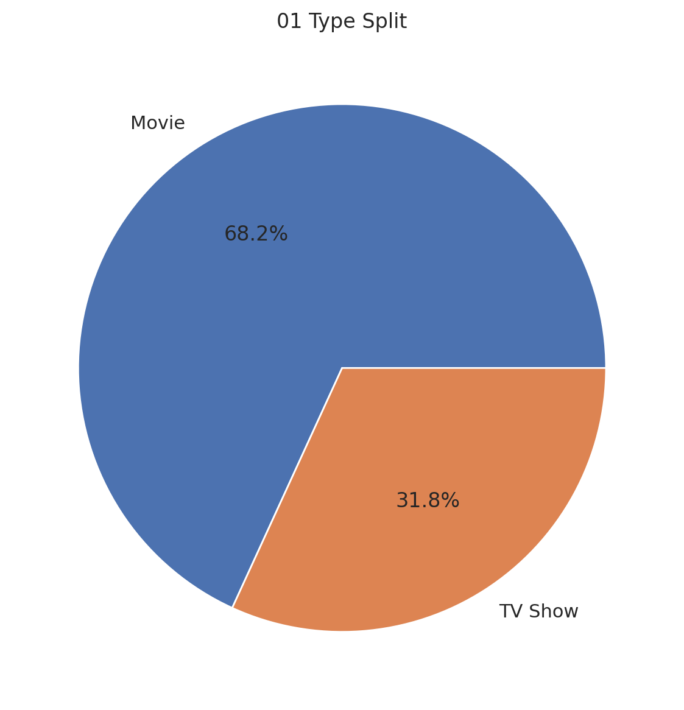
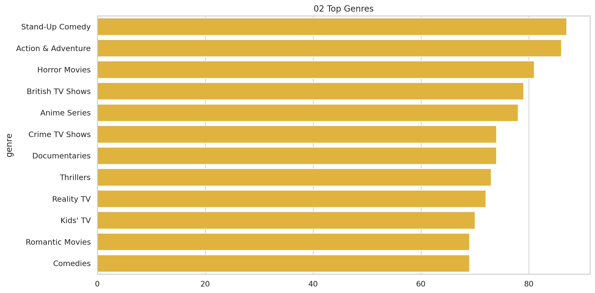
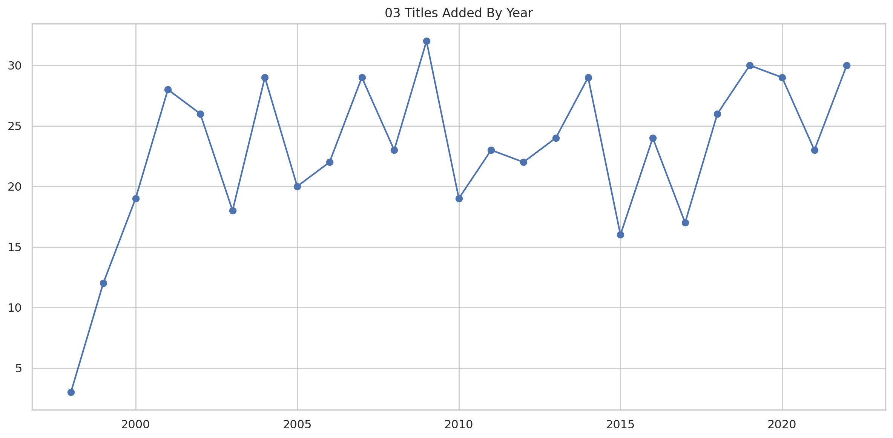
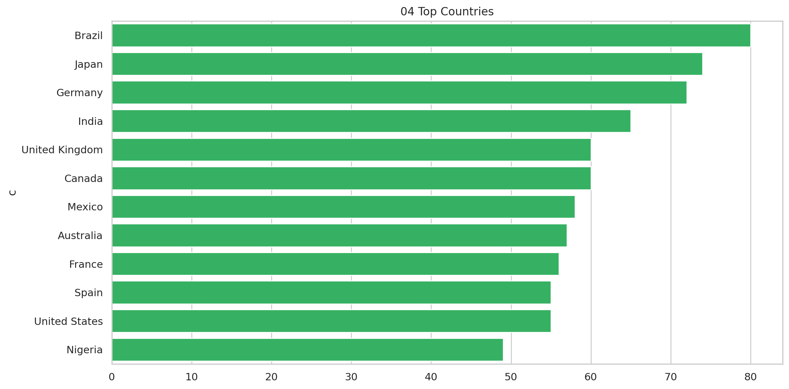
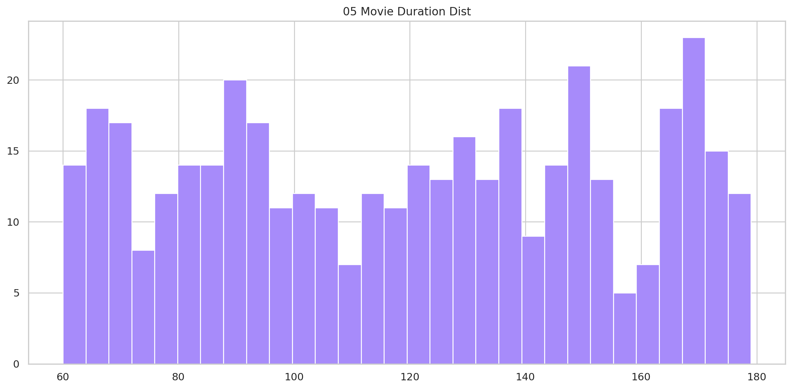
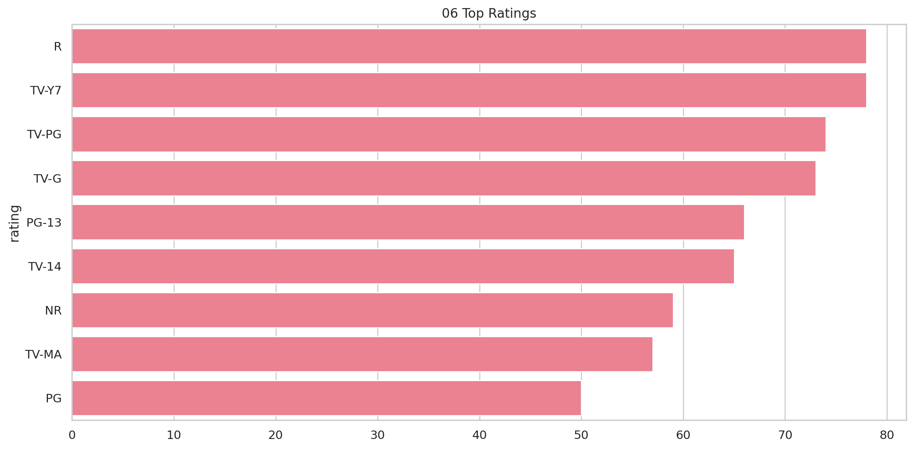
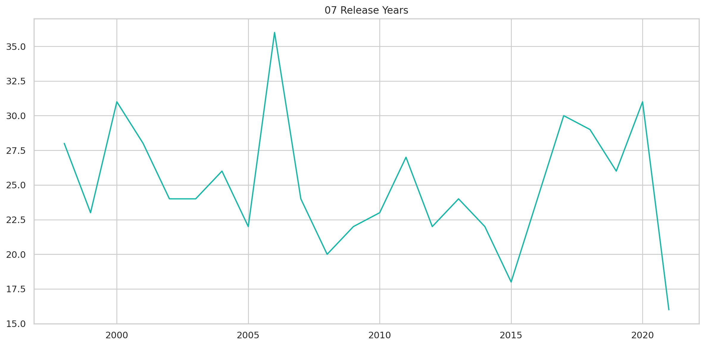
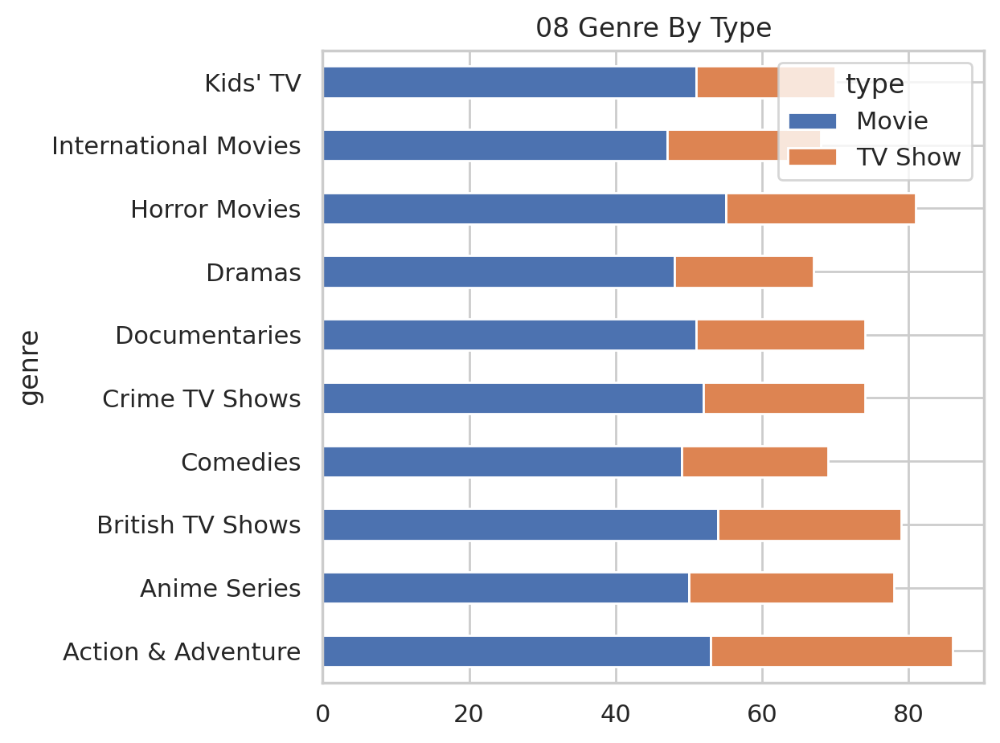

# Netflix Content Portfolio

## Executive Summary
Catalog composition, release cadence, genres, and geographic content footprint.

## Key Findings
- The catalog has 600 titles; movies represent 68.2%.
- Stand-Up Comedy is the most frequent tag (87 titles).
- Brazil is the leading listed production country (80 titles).
- Catalog additions peak in 2009 with 32 titles.
- Median movie duration is 121 minutes.
- R is the most common maturity rating.

## Methodology
Original catalog records were retained. Dates and minute-based durations were parsed where available. Multi-value country and genre fields were split to evaluate tag-level composition; tag totals can therefore exceed the title count.

## Visualizations

