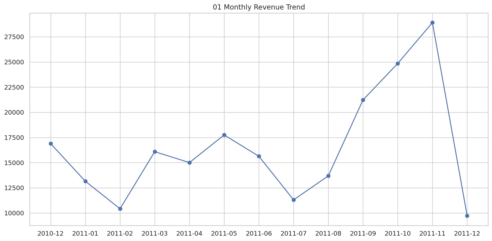
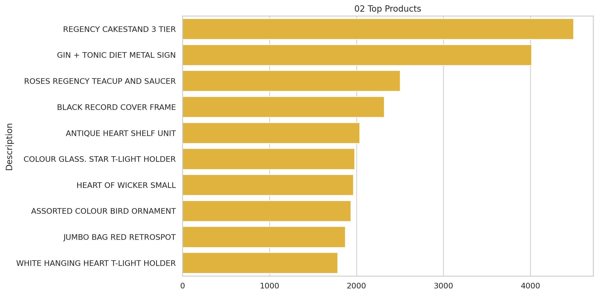
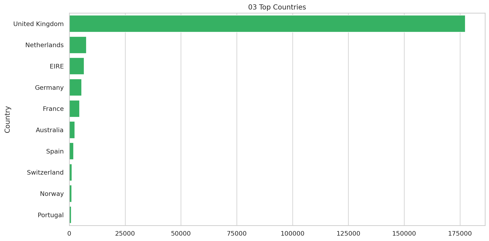
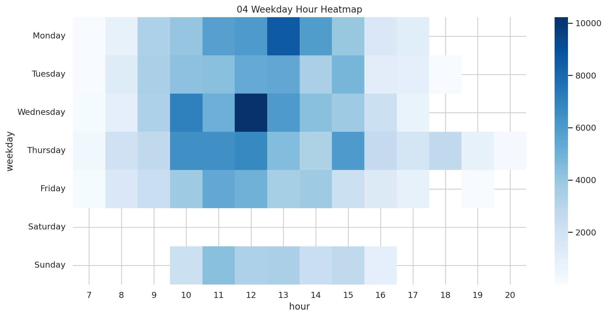
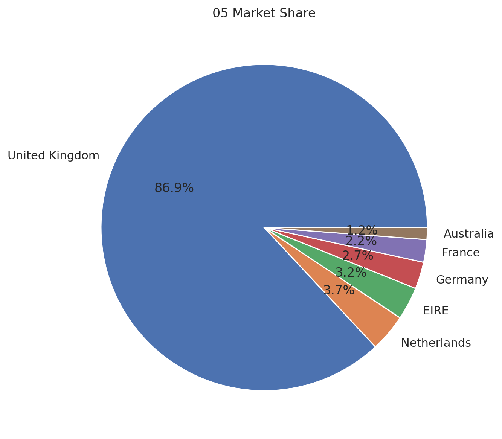
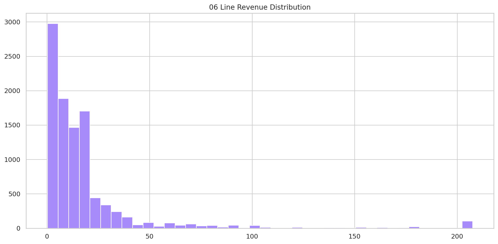
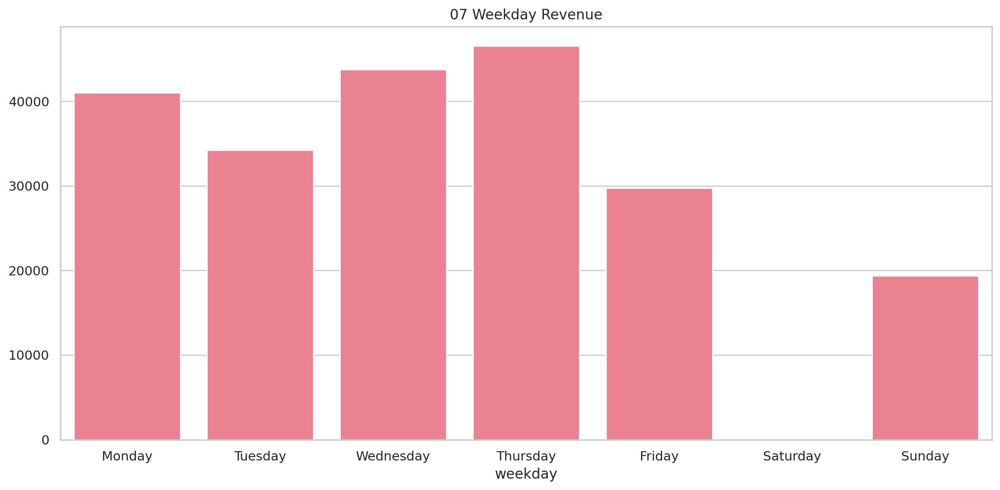
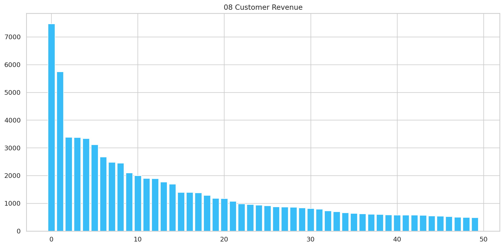

# Retail Revenue Performance

## Executive Summary
Transaction-level commercial performance, customer concentration, and demand timing.

## Key Findings
- United Kingdom contributes 82.6% of sample revenue and is the commercial anchor.
- Revenue totals £214,660 across 6,417 invoices.
- REGENCY CAKESTAND 3 TIER is the largest product by revenue at £4,496.
- Thursday is the strongest weekday by revenue.
- Top 10 customers contribute 16.8% of revenue.
- Activity peaks at 12:00.

## Methodology
Duplicate transaction rows were removed. The supplied line-level revenue field was aggregated across transactions, products, countries, weekdays, hours, and customers; results are limited to the supplied sample.

## Visualizations

