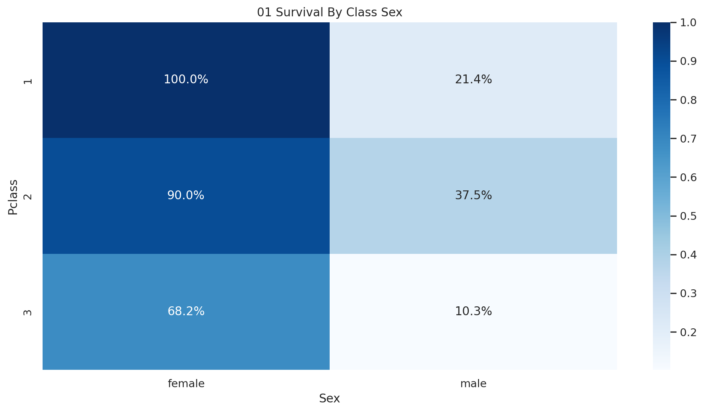
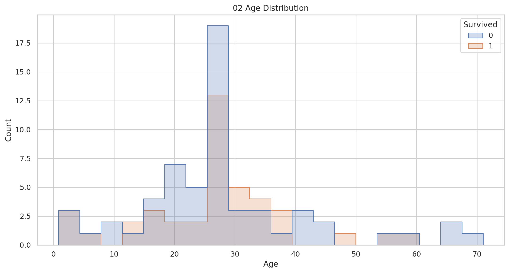
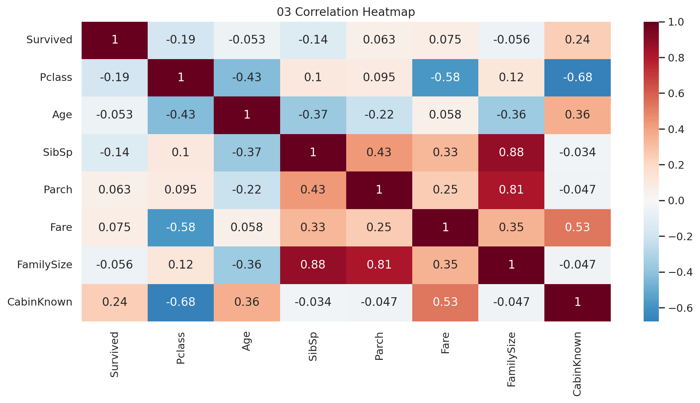
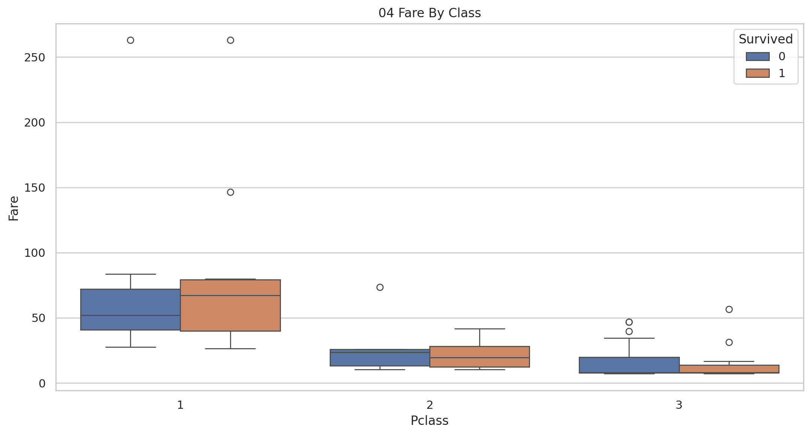
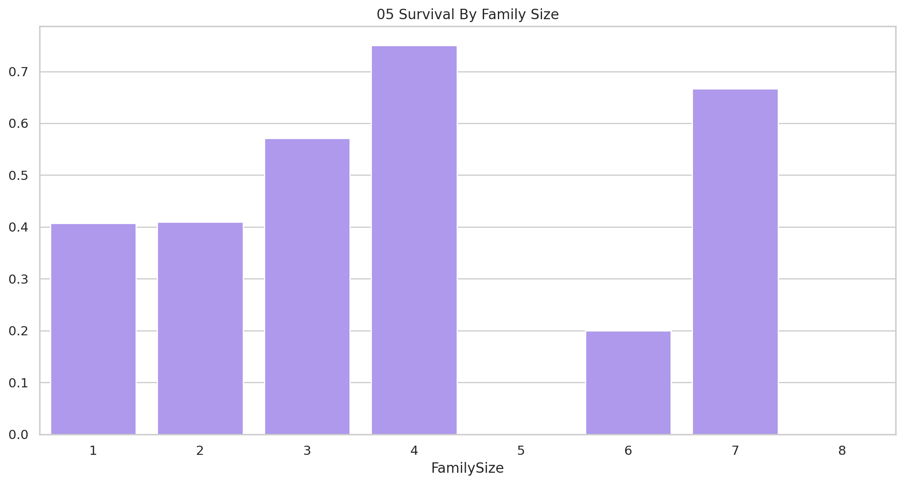
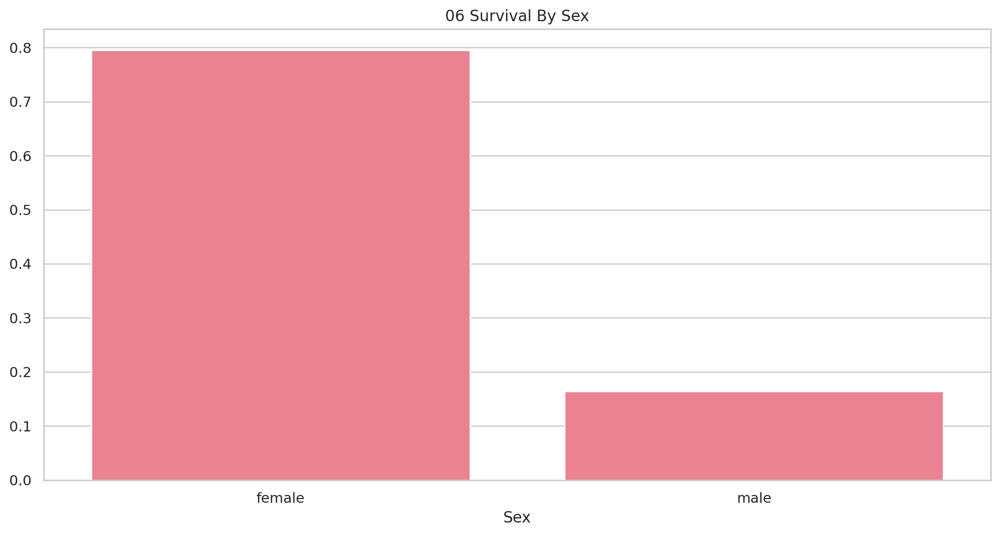
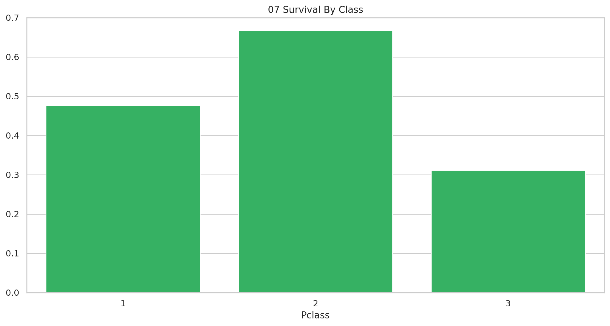
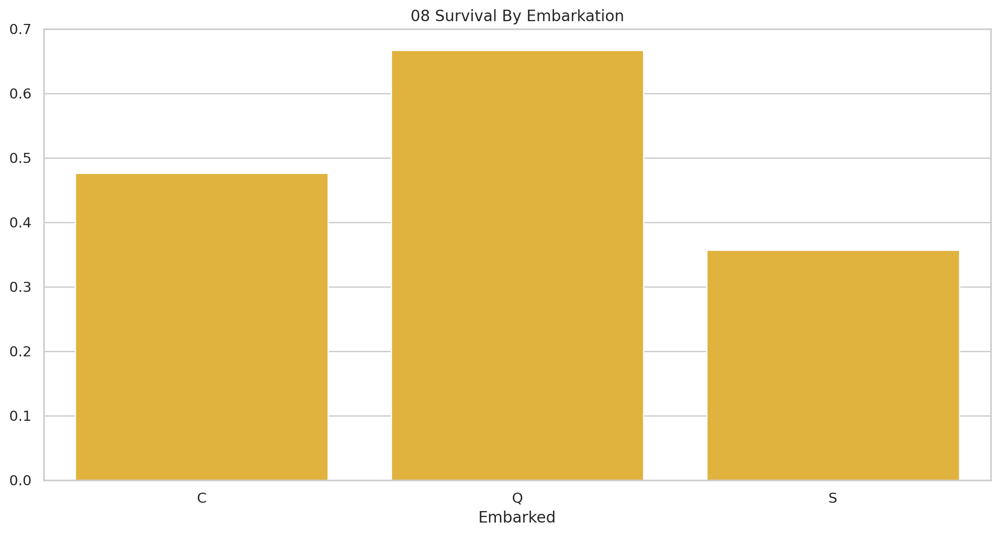

# Titanic Survival Analysis

## Executive Summary
Passenger-level survival patterns across class, sex, age, and family structure.

## Key Findings
- Overall survival is 41.0%.
- Female survival is 79.5% versus 16.4% for males.
- First-class survival is 47.6% versus 31.1% in third class.
- Survivors paid £6.19 more on average.
- Q has the highest observed embarkation-port survival rate.
- Family size 4 has the highest observed survival rate.

## Methodology
The passenger dataset was analyzed descriptively. Missing ages were filled with the sample median for demographic charts; cabin availability was represented as a binary feature. Results are limited to the supplied sample.

## Visualizations

