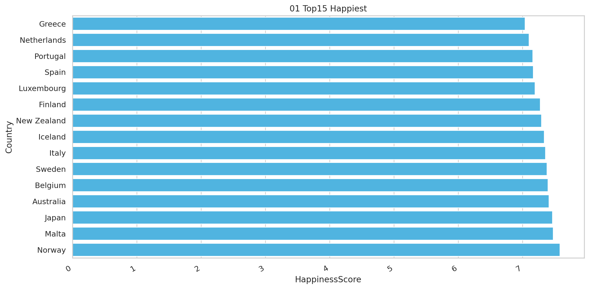
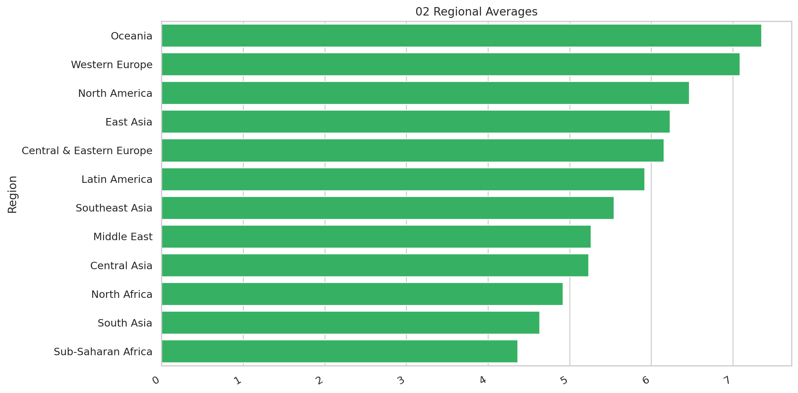
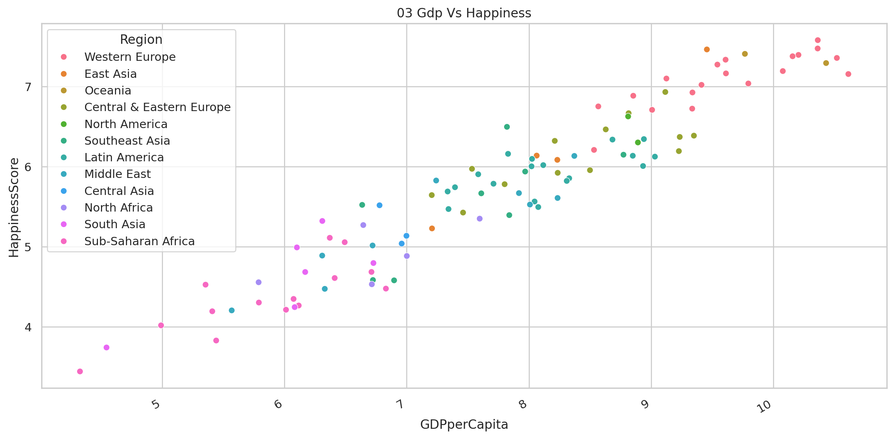
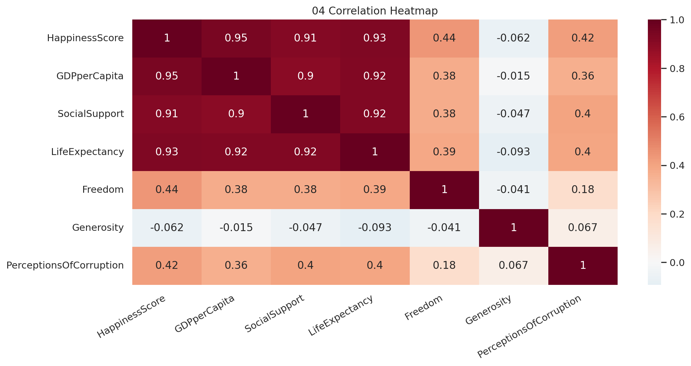
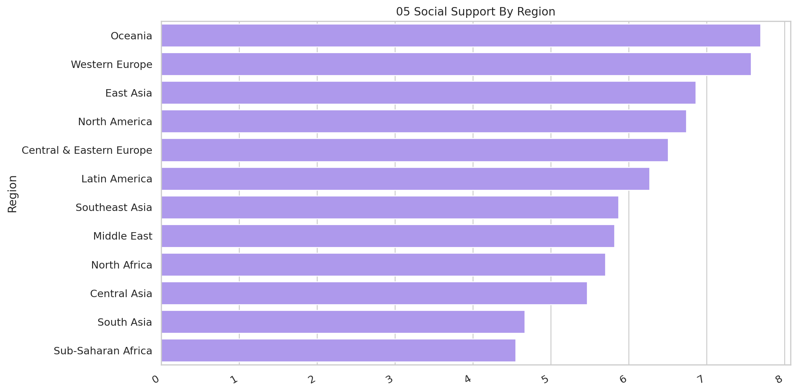
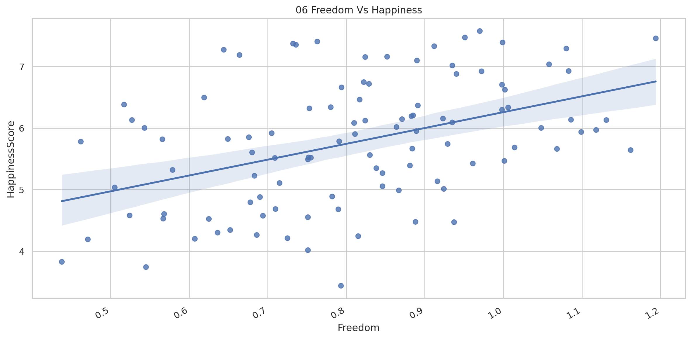
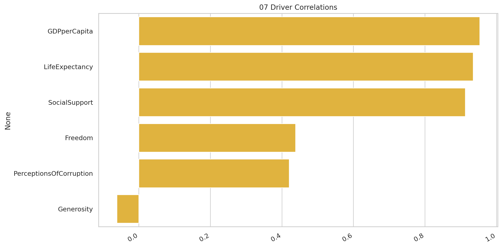
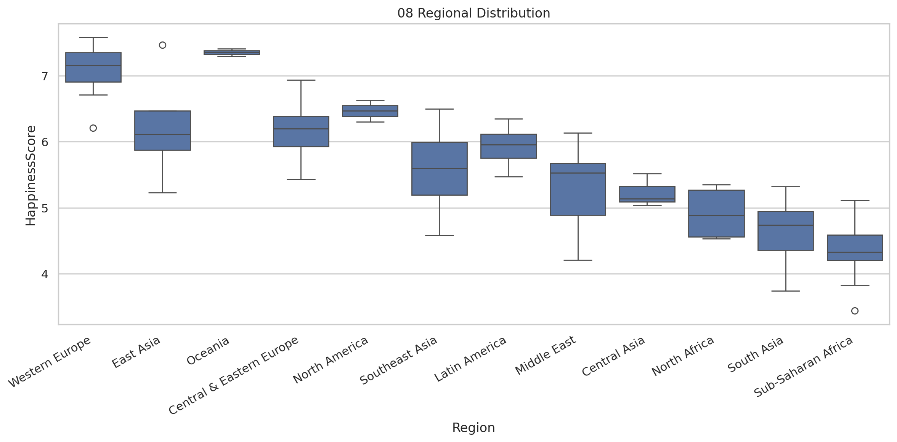

# World Happiness Drivers

## Executive Summary
Cross-country assessment of well-being and its strongest supporting factors.

## Key Findings
- Norway leads at 7.579.
- GDPperCapita is the strongest measured correlate of happiness (r = 0.95).
- Oceania has the highest regional average (7.35).
- The regional spread is 2.99 points.
- GDP per capita and social support have visible positive relationships with happiness.
- The final analytical dataset contains 103 complete country records.

## Methodology
Country records were checked for duplicate and missing values. The analysis benchmarks happiness by region and calculates Pearson correlations between the score and the available economic, social, health, freedom, generosity, and corruption measures.

## Visualizations

